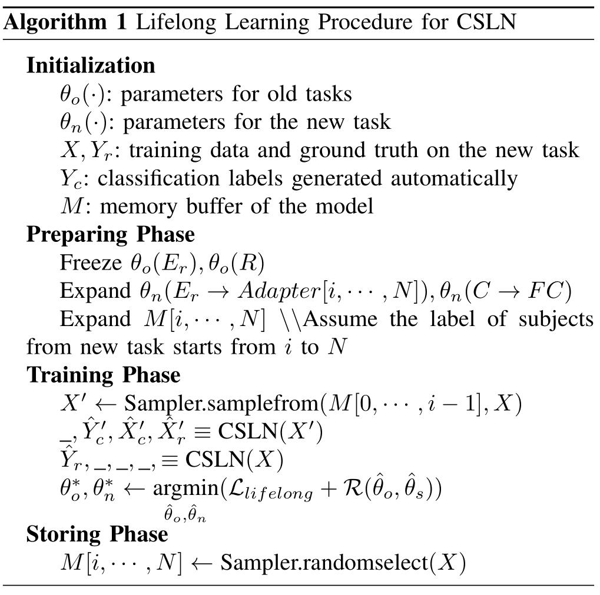

# sEMG-master

[//]: # (> We are our own true masters)

Simple toolkit of predicting hand motion via sEMG signal

> This toolkit project is currently in its early stages and is a work in progress. It is now an early representation. 
> 
> Expect periodic updates, but the frequency and timing of these updates are subject to change
## Usage

### Dataset
> Note: This work is validated upon the Ninapro DB2 dataset; for compatibility with other datasets, additional code adaptations may be required.
1. Put the mat data to ./Data/rawdata
2. Extract feature with ./utils/DataProcess/FeatureExtract.py

### Direct Training
> ./Executors/Trainer.py 

### Transfer/Lifelong
> Support LCSN only. 
> 
> All under Executors
> * EWC:
  EWC_LCSN.py
> * LwF:
  LearningWithoutForgettingLCSN.py
> * DomainAdaption:
  DomainAdaption.py
> * FineTuning:
  FineTuningLSCN.py
> * LifelongMethod:LLTransferLCSN.py
 
### Fine tune the memory
> * Memload.py

## Reference
### BERT-based Cross Subject Models
```
@article{lin2022bert,
  title={A BERT based method for continuous estimation of cross-subject hand kinematics from surface electromyographic signals},
  author={Lin, Chuang and Chen, Xingjian and Guo, Weiyu and Jiang, Ning and Farina, Dario and Su, Jingyong},
  journal={IEEE Transactions on Neural Systems and Rehabilitation Engineering},
  volume={31},
  pages={87--96},
  year={2022},
  publisher={IEEE}
}
```
### CSLN(LCSN)
```
@article{10530128,
  author={Chen, Xingjian and Guo, Weiyu and Lin, Chuang and Jiang, Ning and Su, Jingyong},
  journal={IEEE Transactions on Neural Systems and Rehabilitation Engineering}, 
  title={Cross-Subject Lifelong Learning for Continuous Estimation From Surface Electromyographic Signal}, 
  year={2024},
  volume={32},
  number={},
  pages={1965-1973},
  keywords={Task analysis;Adaptation models;Feature extraction;Estimation;Training;Transfer learning;Predictive models;sEMG;cross-subject;continuous estimation;lifelong learning;hand kinematics},
  doi={10.1109/TNSRE.2024.3400535}
}

```
#### Lifelong Learning Strategy

